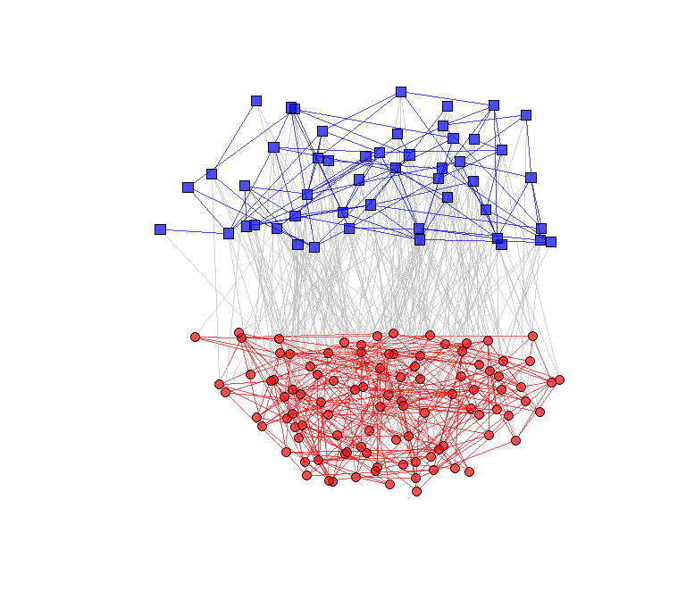

multinets: Multilevel Network Analysis
================

[](http://www.repostatus.org/#active)
[](https://www.gnu.org/licenses/gpl-3.0.en.html)
[](https://travis-ci.org/neylsoncrepalde/multinets)

-----

[](https://cran.r-project.org/)
[](https://cran.r-project.org/package=multinets)

<!-- README.md is generated from README.Rmd. Please edit that file -->

`multinets` is an R package that provides tools to visualize and analyze
Multilevel Network Data. It was built as an extension to the
[`igraph`](http://igraph.org/r/) package.

## Installation

The `multinets` package is on CRAN. It is developed under control
version using Git and is hosted in GitHub. You can download it from CRAN
using:

``` r
install.packages("multinets")
```

You can download the development version from GitHub using `devtools`:

``` r
# install.packages("devtools")
devtools::install_github("neylsoncrepalde/multinets")
```

## Usage

As a basic example, we will plot a multilevel network. We are going to
use `linked_sim`, a simulated multilevel network dataset.

``` r
library(igraph)
#> 
#> Attaching package: 'igraph'
#> The following objects are masked from 'package:stats':
#> 
#>     decompose, spectrum
#> The following object is masked from 'package:base':
#> 
#>     union
library(multinets)
#> multinets was developed by Neylson Crepalde as an extension to 'igraph'

# Load the dataset
data("linked_sim")

# Test if the data is a multilevel network
is_multilevel(linked_sim)
#> [1] TRUE

# Set the layout coordinates
l <- layout_multilevel(linked_sim, layout = layout_with_kk)

# Set different colors and shapes for each level vertices
linked_sim <- set_color_multilevel(linked_sim)
linked_sim <- set_shape_multilevel(linked_sim)

# Plot
plot(linked_sim, layout = l, vertex.size = 5, vertex.label = NA)
```

<!-- -->
