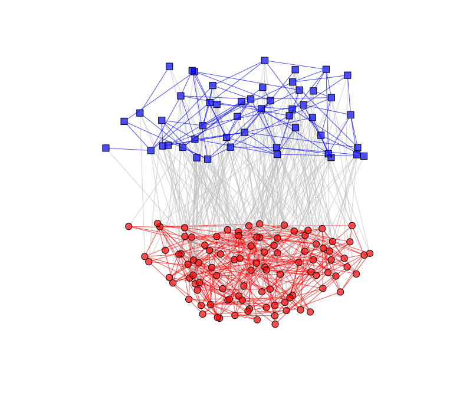

multinets: Multilevel Network Analysis
================

<!-- README.md is generated from README.Rmd. Please edit that file -->
`multinets` is an R package that provides tools to visualize and analyze Multilevel Network Data. It was built as an extension to the [`igraph`](http://igraph.org/r/) package.

Installation
------------

The `multinets` package is developed under control version using Git and is hosted in GitHub. You can download it from GitHub using `devtools`:

``` r
# install.packages("devtools")
devtools::install_github("neylsoncrepalde/multinets")
```

Usage
-----

As a basic example, we will plot a multilevel network. We are going to use `linked_sim`, a simulated multilevel network dataset.

``` r
library(igraph)
```

    ## 
    ## Attaching package: 'igraph'

    ## The following objects are masked from 'package:stats':
    ## 
    ##     decompose, spectrum

    ## The following object is masked from 'package:base':
    ## 
    ##     union

``` r
library(multinets)
```

    ## multinets was developed by Neylson Crepalde as an extension to igraph

``` r
# Load the dataset
data("linked_sim")

# Test if the data is a multilevel network
is_multilevel(linked_sim)
```

    ## [1] TRUE

``` r
# Set the layout coordinates
l <- layout_multilevel(linked_sim, layout = layout_with_kk)

# Set different colors and shapes for each level vertices
linked_sim <- set_color_multilevel(linked_sim)
linked_sim <- set_shape_multilevel(linked_sim)

# Plot
plot(linked_sim, layout = l, vertex.size = 5, vertex.label = NA)
```


